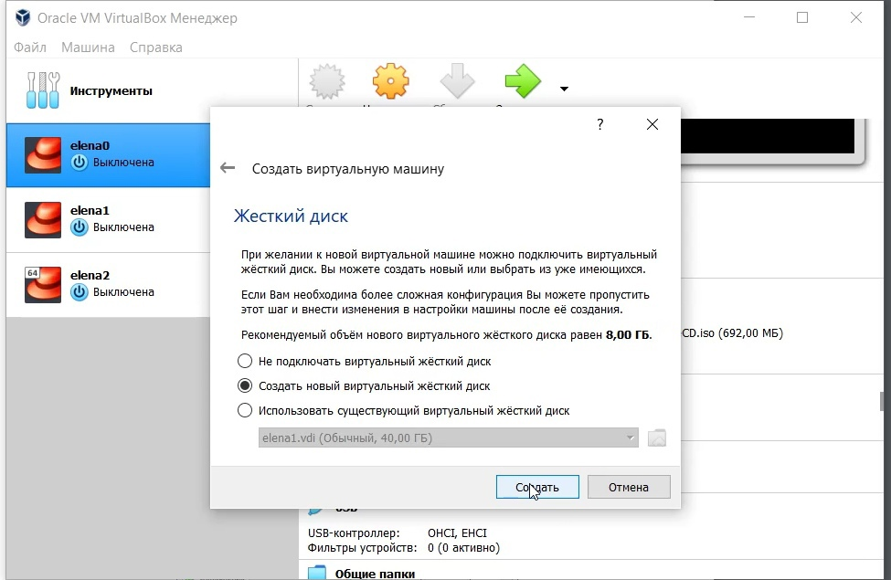
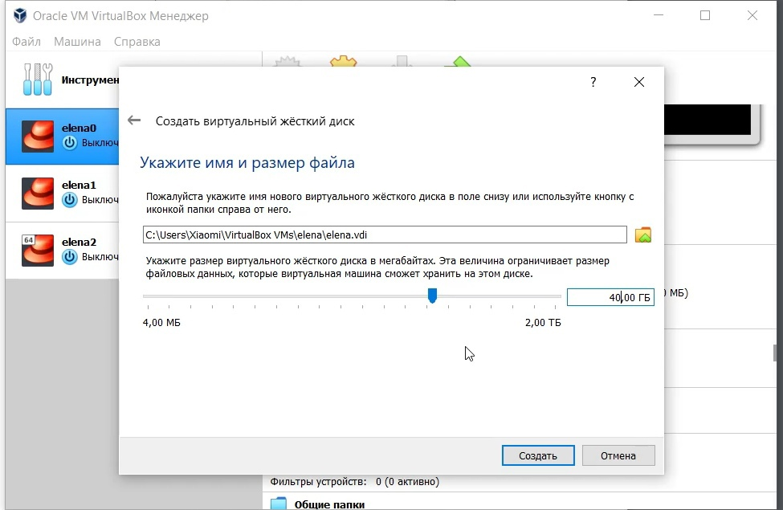
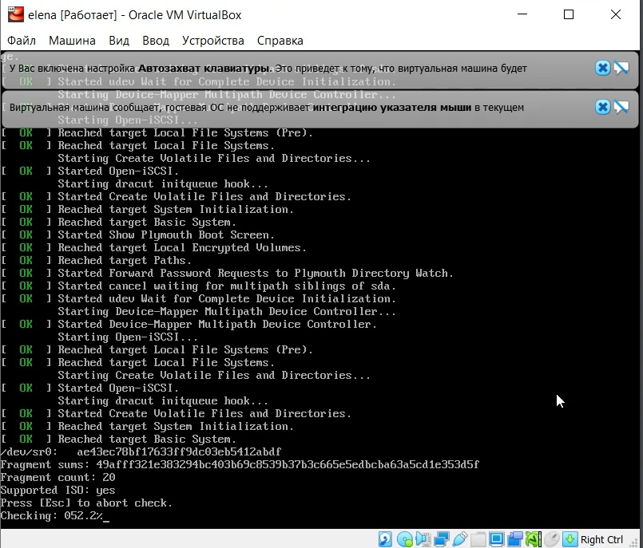
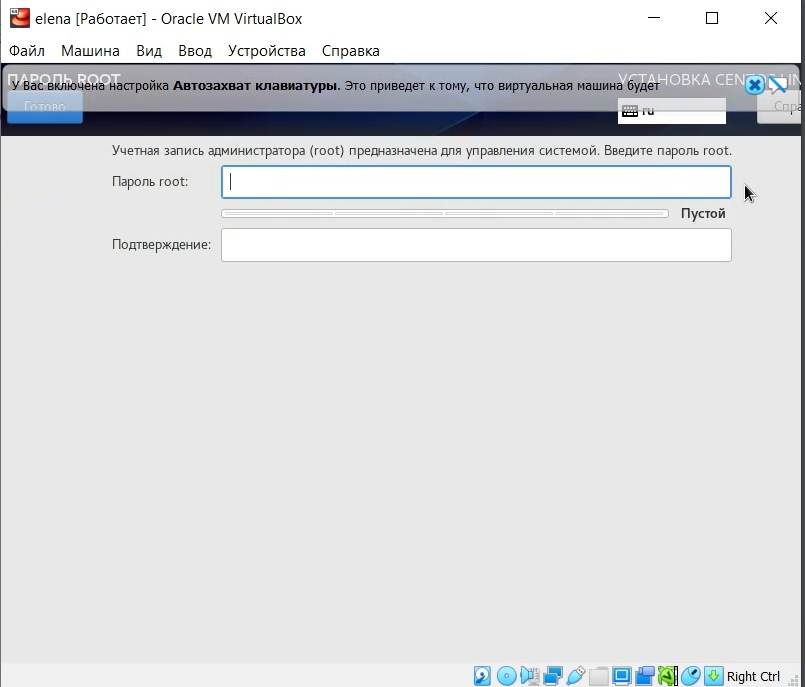
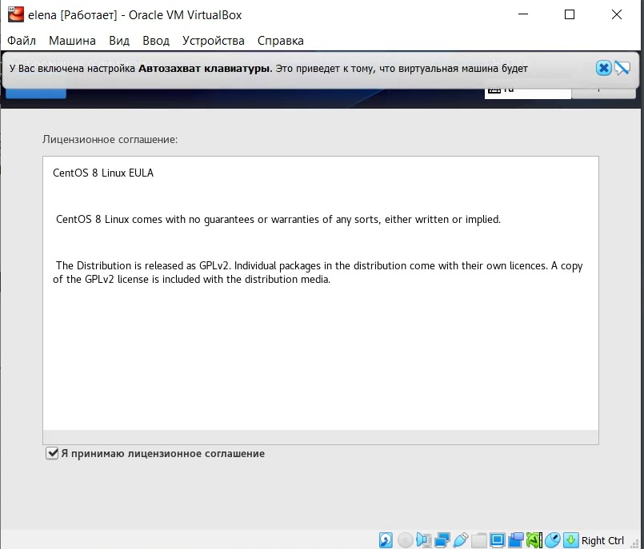
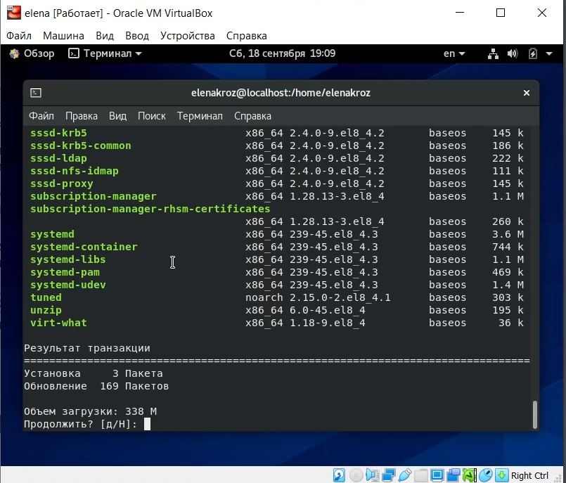
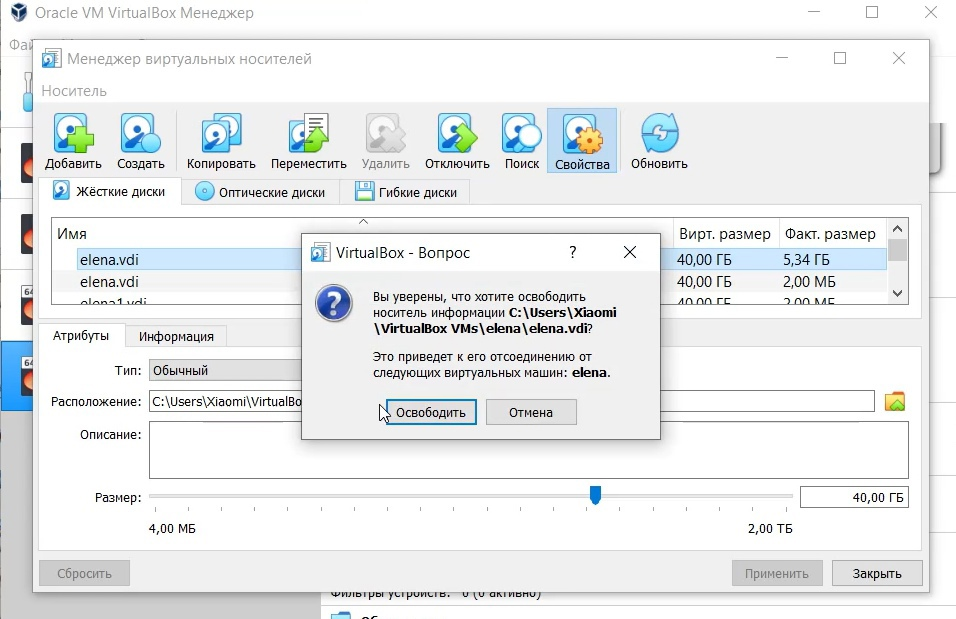

---
## Front matter
lang: ru-RU
title: Информационная безопасность. Лабораторная работа №1
author: |
	 Кроз Елена Константиновна НФИбд-02-18\inst{1}

institute: |
	\inst{1}Российский Университет Дружбы Народов

date: МатМод--2021, 18 сентября, 2021, Москва, Россия

## Formatting
mainfont: PT Serif
romanfont: PT Serif
sansfont: PT Sans
monofont: PT Mono
toc: false
slide_level: 2
theme: metropolis
header-includes: 
 - \metroset{progressbar=frametitle,sectionpage=progressbar,numbering=fraction}
 - '\makeatletter'
 - '\beamer@ignorenonframefalse'
 - '\makeatother'
aspectratio: 43
section-titles: true

---

# Цели и задачи работы

## Цель лабораторной работы

Приобретение практических навыков установки операционной системы на виртуальную машину, настройки минимально необходимых для
дальнейшей работы сервисов.

## Задание к лабораторной работе

Установить на виртуальную машину VirtualBox операционной системы
Linux, дистрибутив Centos.

# Процесс выполнения лабораторной работы

## Процесс выполнения лабораторной работы

{ #fig:001 width=70% height=70% }

## Процесс выполнения лабораторной работы 

{ #fig:002 width=70% height=70% }

## Процесс выполнения лабораторной работы 

{ #fig:003 width=70% height=70% }

## Процесс выполнения лабораторной работы 

{ #fig:004 width=70% height=70% }

## Процесс выполнения лабораторной работы 

{ #fig:005 width=70% height=70% }

## Процесс выполнения лабораторной работы 

{ #fig:006 width=70% height=70% }

## Процесс выполнения лабораторной работы 

{ #fig:007 width=70% height=70% }

## Процесс выполнения лабораторной работы 

{ #fig:008 width=70% height=70% }

## Процесс выполнения лабораторной работы 

{ #fig:009 width=70% height=70% }

## Процесс выполнения лабораторной работы 

{ #fig:010 width=70% height=70% }

## Процесс выполнения лабораторной работы 

{ #fig:011 width=70% height=70% }

## Процесс выполнения лабораторной работы 

{ #fig:012 width=70% height=70% }

## Процесс выполнения лабораторной работы 

{ #fig:013 width=70% height=70% }

## Процесс выполнения лабораторной работы 

{ #fig:014 width=70% height=70% }

## Процесс выполнения лабораторной работы 

{ #fig:015 width=70% height=70% }

## Процесс выполнения лабораторной работы 

{ #fig:016 width=70% height=70% }

## Процесс выполнения лабораторной работы 

{ #fig:017 width=70% height=70% }

## Процесс выполнения лабораторной работы 

{ #fig:018 width=70% height=70% }

## Процесс выполнения лабораторной работы 

{ #fig:019 width=70% height=70% }

# Выводы по проделанной работе

## Вывод

В ходе выполнения лабораторной работы я приобрела практические навыки установки операционной системы на виртуальную машину, настройки минимально необходимых для
дальнейшей работы сервисов.