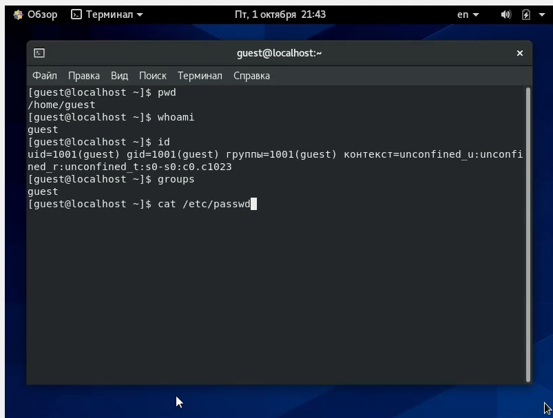
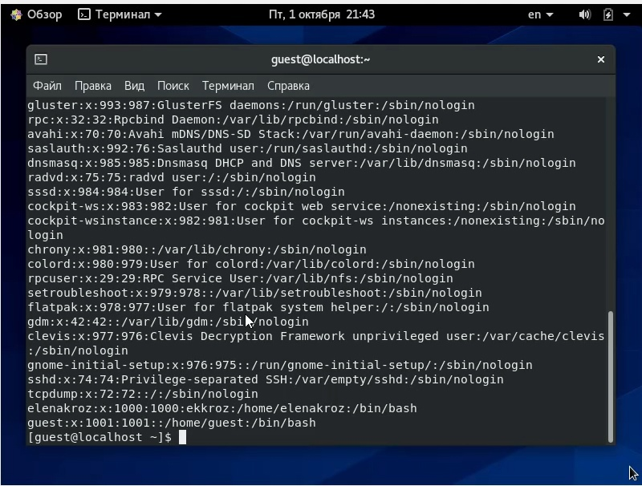
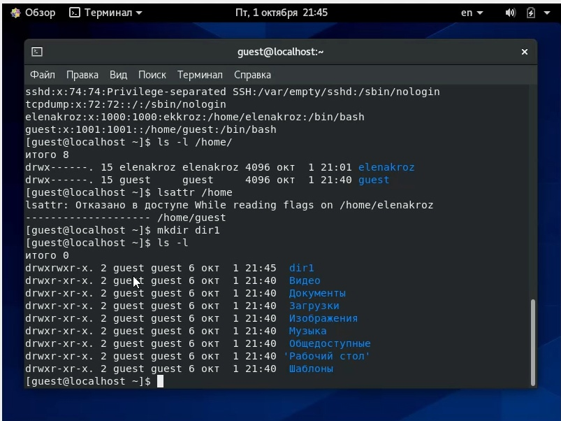
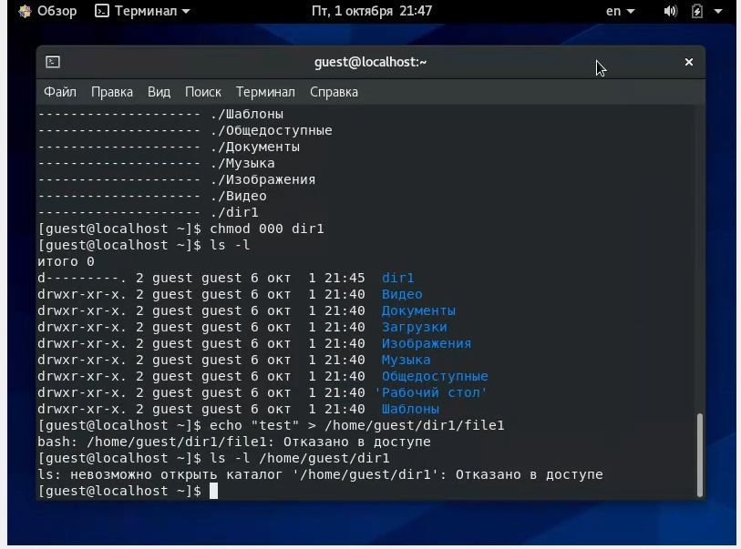

---
## Front matter
lang: ru-RU
title: Лабораторная работа №2. Дискреционное разграничение прав в Linux. Основные атрибуты
author: |
	 Кроз Елена Константиновна НФИбд-02-18\inst{1}

institute: |
	\inst{1}Российский Университет Дружбы Народов

date: 1 октября, 2021, Москва, Россия

## Formatting
mainfont: PT Serif
romanfont: PT Serif
sansfont: PT Sans
monofont: PT Mono
toc: false
slide_level: 2
theme: metropolis
header-includes: 
 - \metroset{progressbar=frametitle,sectionpage=progressbar,numbering=fraction}
 - '\makeatletter'
 - '\beamer@ignorenonframefalse'
 - '\makeatother'
aspectratio: 43
section-titles: true

---

# Цели и задачи работы

## Цель лабораторной работы

Получить практические навыки работы в консоли с атрибутами файлов, закрепить теоретические основы дискреционного разграничения доступа в современных системах с открытым кодом на базе ОС Linux.

# Процесс выполнения лабораторной работы

## Определяем UID и группу

{ #fig:001 width=70% }

## Файл с данными о пользователях

{ #fig:002 width=70% }

## Доступ к домашним директориям

{ #fig:003 width=70% }

## Атрибуты директории

{ #fig:004 width=70% }

# Выводы по проделанной работе

## Вывод

В ходе выполнения лабораторной работы были получены навыки работы с атрибутами файлов и сведения о разграничении доступа.